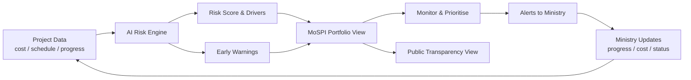
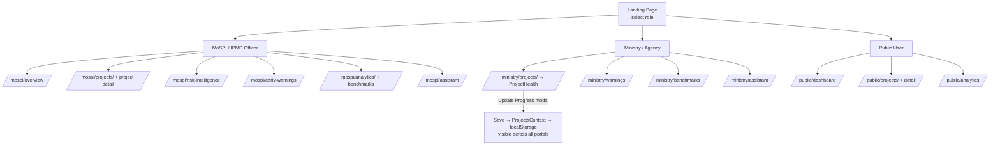

# PAIMANA AI — Project Flow

Predictive Infrastructure Risk & Early Warning System
Smart India Hackathon 2026 | SIH26103 | MoSPI

---

## End-to-End System Flow

### Pipeline

1. **Ingest** — Project data (cost, physical progress, schedules) enters the system.
2. **Predict** — AI engine computes risk score, cost risk and time risk, and generates risk drivers.
3. **Warn** — Critical/high signals are raised as early warnings.
4. **Monitor** — MoSPI / IPMD officer reviews the portfolio and prioritises high-risk projects.
5. **Act** — Ministry / agency updates project progress, expenditure, status and completion dates (via the edit modal).
6. **Loop** — Updated data feeds back into the risk engine for re-evaluation.
7. **Publish** — Public dashboard provides a read-only transparency view.

---

## App / Navigation Flow

### Key Flows

- **Landing** — role cards navigate to each portal's starting page (`/mospi/overview`, `/ministry/projects`, `/public/dashboard`).
- **Role switching** — header dropdown updates both the route and the sidebar navigation.
- **Ministry edit path** — `My Projects` → click project → `Update Progress` → modal → Save → data persists in `ProjectsContext` + localStorage → reflected in MoSPI and public views as well.
- **Routing** — all routes live under `BrowserRouter` in `src/App.jsx`; `/mospi`, `/ministry`, and `/public` redirect to their default dashboards.

---

## Role Permissions

| Role                | Portal   | Views                                                              | Edit Rights                          |
| ------------------- | -------- | ------------------------------------------------------------------ | ------------------------------------ |
| MoSPI / IPMD Officer| `/mospi` | Overview, Projects+Detail, Risk Intelligence, Early Warnings, Analytics, Benchmarks, Assistant | Read-only                           |
| Ministry / Agency   | `/ministry` | Projects, Project Health, Warnings, Benchmarks, Assistant      | Update progress, costs, status, dates |
| Public User         | `/public` | Dashboard, Projects+Detail, Analytics                              | Read-only                            |

> Risk score, risk level and risk drivers are **not** user-editable.